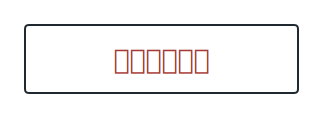
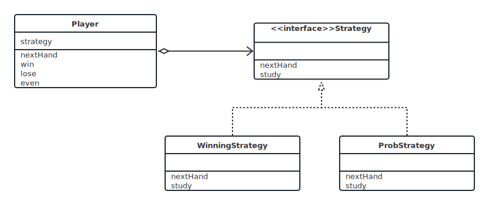
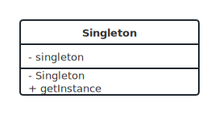
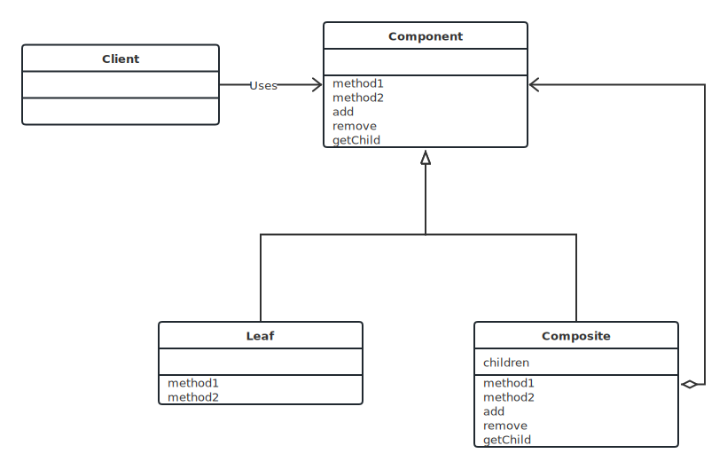

  

<h1 align="center">Design Pattern Code Implementation via Java</h1>

Design Pattern is classics raised by **GoF**, and thanks for **Hiroshi Yuki**, I can learn the intellectual wealth via Java.
It aims to provide ideas of System Structured systems analysis and design method, especially the one who wants to engage in software development.

The key features of Design Pattern are:

- Support every programming language, not only for Java.
- Provide a standard method to design more flexible software.

There are three different classifications of design patterns here

> 😶‍🌫️ Note : I will upload the complete document when I finish the whole project.
> Otherwise, it seems so inefficient that I can't focus on the primary meaning why I do this.

## contents

<!-- @import "[TOC]" {cmd="toc" depthFrom=1 depthTo=3 orderedList=false} -->

<!-- code_chunk_output -->

- [🏃Behavior](#behavior)
  - [Strategy](#strategy)
- [👷Creation](#-creation)
  - [Singleton](#singleton)
- [🏠Structure](#-structure)
  - [Composite](#composite)

<!-- /code_chunk_output -->

---

## 🏃Behavior

### Strategy

> 整体的替换算法

#### Keywords

- 委托

#### Architecture Diagram

  

## 👷 Creation

### Singleton

> 只有一个实例

#### Keywords

- 私有
- 静态
- 加锁

#### Architecture Diagram

  

## 🏠 Structure

### Composite

> 容器和内容的一致性

#### Keywords

- 递归

#### Architecture Diagram

  

